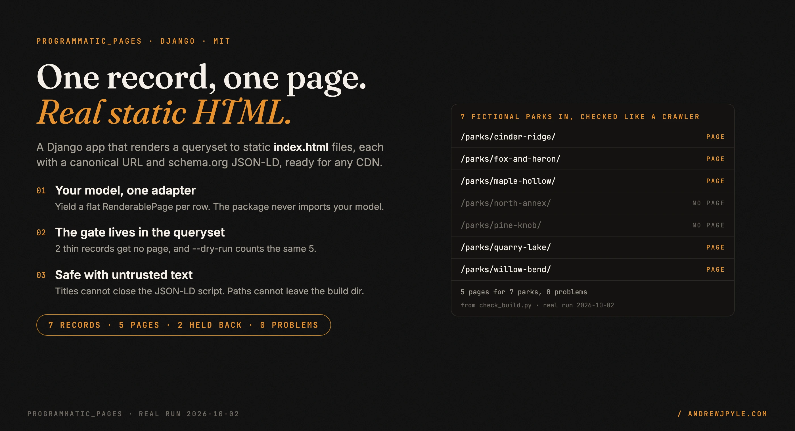
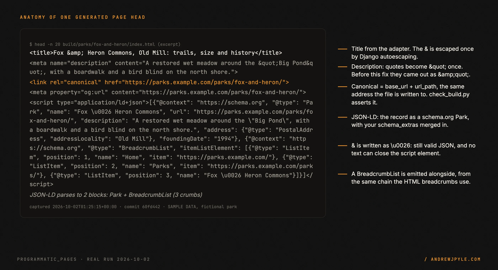
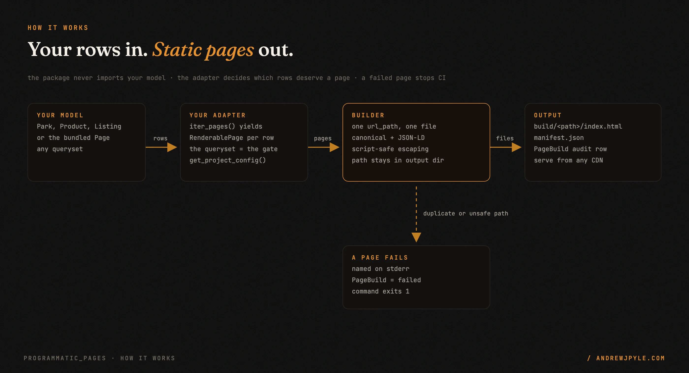
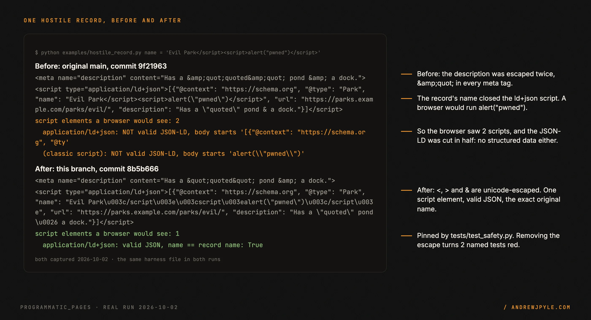

<p align="center">
  
</p>

<p align="center">
  <a href="https://github.com/andrewjpyle/programmatic_pages/actions/workflows/test.yml"></a>
  
  
  
</p>

# Static pages from a Django queryset, one per real record

`programmatic_pages` is a Django reusable app that turns rows you already have (parks, products,
ZIP codes, listings) into plain static `index.html` files: one page per record, each with a
canonical URL, Open Graph tags and schema.org JSON-LD. You serve the output directory from nginx or
any CDN. There is no prerender service and no runtime.

- **Your model, one adapter.** Write a `PageAdapter` that yields a flat `RenderablePage` per row.
  The package never imports your model. A bundled `Page` model is there if you have none.
- **The gate is a queryset.** Which records deserve a page is decided in your adapter's query, so
  `--dry-run` reports the same count the build writes.
- **Safe with text you did not write.** A title cannot close the JSON-LD `<script>`, a `url_path`
  cannot write outside the output directory, and a failed page makes the command exit 1.
- **An audit trail.** Every run writes `manifest.json` and a `PageBuild` row with status, counts
  and the name of every failed page.

> **The one idea worth stealing, even if you never run this code:** decide which records get a
> page in the data layer, not in the template. A template that renders ``
> still ships a thin page for every row, and nothing counts them. A queryset that excludes rows
> without a description ships no page at all, and `--dry-run` tells you the number before you
> build. In the demo below, 7 parks go in and 5 pages come out.

---

## 60 seconds to a built site

The demo is 7 fictional parks (SAMPLE DATA) in a model of their own, with a custom adapter. The
package is not on PyPI yet, so install it from a checkout.

```bash
git clone https://github.com/andrewjpyle/programmatic_pages.git
cd programmatic_pages
python -m venv .venv && source .venv/bin/activate
pip install -e .
cd examples/parks_demo
python manage.py migrate && python seed.py
python manage.py build_static_pages --project parks \
    --adapter parks.adapters.ParkPageAdapter --output-dir ./build
python check_build.py ./build
```

This is the real output ([`examples/parks_demo/output/`](examples/parks_demo/output/)):

```
Project: Example County Parks (parks)
Base URL: https://parks.example.com
Output: ./build
  [5] built=5 errors=0 (2210 pages/s)

==================================================
  Built 5 pages (0 errors) in 0.0s
  Output: ./build
  Manifest: ./build/manifest.json
  Rate: 2146 pages/s
  Build ID: 1
```

`check_build.py` then reads every page the way a crawler would:

```
ok    /parks/cinder-ridge/  canonical == JSON-LD url, Park, 1 script
ok    /parks/fox-and-heron/  canonical == JSON-LD url, Park, 1 script
ok    /parks/maple-hollow/  canonical == JSON-LD url, Park, 1 script
skip  /parks/north-annex/  (no page: not enough data)
skip  /parks/pine-knob/  (no page: not enough data)
ok    /parks/quarry-lake/  canonical == JSON-LD url, Park, 1 script
ok    /parks/willow-bend/  canonical == JSON-LD url, Park, 1 script
5 pages for 7 parks, 0 problems
```

<p align="center"></p>

The full head is in
[`examples/parks_demo/output/fox-and-heron.head.html`](examples/parks_demo/output/fox-and-heron.head.html).
CI runs this demo and the checker on every push. A 50-page demo on the bundled `Page` model, with
real ZIP codes, is in [`examples/us_zip_codes/`](examples/us_zip_codes/).

## Wire it to your own model

Add the app and write one adapter. This sketch follows the demo's adapter
([full file](examples/parks_demo/parks/adapters.py)), with the body moved to a template:

```python
# settings.py
INSTALLED_APPS = [..., "programmatic_pages"]
```

```python
# parks/adapters.py
from programmatic_pages import BreadcrumbItem, PageAdapter, ProjectConfig, RenderablePage


class ParkPageAdapter(PageAdapter):
    def get_project_config(self, project_key):
        return ProjectConfig(base_url="https://parks.example.com", site_name="Example County Parks")

    def iter_pages(self, project_key, *, entity_type=None, status="published"):
        # The gate: a park with no description or trail data gets no page.
        eligible = Park.objects.exclude(description="").exclude(trail_miles=None)
        for park in eligible.iterator():
            yield RenderablePage(
                url_path=f"parks/{park.slug}/",
                title=f"{park.name}, {park.city}: trails, size and history",
                meta_description=park.description,
                h1=park.name,
                body_html=render_to_string("parks/body.html", {"park": park}),
                schema_type="Park",
                schema_extras={"address": {"@type": "PostalAddress", "addressLocality": park.city}},
                breadcrumb_chain=[
                    BreadcrumbItem(label="Home", url="/"),
                    BreadcrumbItem(label="Parks", url="/parks/"),
                    BreadcrumbItem(label=park.name),  # current page, no url
                ],
            )
```

```bash
python manage.py migrate programmatic_pages   # creates the PageBuild audit table
python manage.py build_static_pages --project parks \
    --adapter parks.adapters.ParkPageAdapter --output-dir ./build
```

`body_html` is inserted as-is (it is your HTML), so escape any untrusted values when you build it,
as the demo does. Everything else (title, description, breadcrumb labels, JSON-LD) is escaped for
you.

**No model yet?** Use the bundled one. Configure the project in settings and create `Page` rows;
the default adapter builds every row with `status="published"`:

```python
PROGRAMMATIC_PAGES = {
    "myproject": {"base_url": "https://example.com", "site_name": "Example", "ga_measurement_id": ""},
}
```

### `build_static_pages` options

| Flag | Default | What it does |
|---|---|---|
| `--project` | required | Project key, passed to your adapter |
| `--adapter` | `programmatic_pages.adapters.DefaultPageAdapter` | Dotted path to a `PageAdapter` |
| `--template` | `programmatic_pages/default.html` | Template name, or a path to a file |
| `--output-dir` | `~/programmatic_pages/build/<project>` | Where the `index.html` tree is written |
| `--entity-type` | all | Passed to `iter_pages` as a filter |
| `--status` | `published` | Passed to `iter_pages` as a filter |
| `--limit` | `0` (all) | Build at most N pages |
| `--concurrency` | `4` | Render and write threads |
| `--dry-run` | off | Count pages and show your adapter's breakdown; write nothing |
| `--triggered-by` | `manual` | Stored on the `PageBuild` row (`manual`, `ci`, ...) |

Exit code: `0` when every page built, `1` when any page failed (each failure is printed as
`url_path: reason` and stored on the `PageBuild` row). Use that to stop a deploy step.

### Your own template

Pass `--template myapp/page.html`. The template receives `title`, `meta_description`,
`canonical_url`, `h1`, `body_html` (use `|safe`), `schema_json` (already script-safe, use `|safe`
inside `<script type="application/ld+json">`), `breadcrumb_chain`, `base_url`, `site_name`,
`ga_id`, `year`, and anything in `RenderablePage.extra_context`. Start from
[`default.html`](src/programmatic_pages/templates/programmatic_pages/default.html).

## How it works

<p align="center"></p>

The command loads your adapter, asks it for the project config and a stream of `RenderablePage`
dataclasses, and hands them to the builder. The builder drops any second page with the same
`url_path` (reported as an error, never a silent overwrite), renders each page with the Django
template engine, builds the JSON-LD from `schema_type`, `schema_extras` and the breadcrumb chain,
and writes `<output>/<url_path>/index.html`. The canonical URL and the JSON-LD `url` are both
`base_url + url_path`, which is also where the file lands. It then writes `manifest.json` and
closes the `PageBuild` row.

It reads only what your adapter yields and writes only inside `--output-dir` plus the one
`PageBuild` row. It makes no network calls.

## Safe with records you did not write

<p align="center"></p>

Page titles often come from scraped or user-submitted data. On the original code, a record named
`Evil Park</script><script>alert("pwned")</script>` broke out of the JSON-LD block, and a quote in
a description came out as `&amp;quot;`. Both are fixed and pinned by
[`tests/test_safety.py`](tests/test_safety.py). Try it with
[`examples/hostile_record.py`](examples/hostile_record.py); no database needed.

## Scope: what it does not do

- **Write your content.** You bring the body HTML and the data behind it. The tool renders what
  you give it.
- **Decide what is worth a page.** That is your adapter's queryset. Nothing here scores content
  or adds `noindex`; a record you yield gets an indexable page.
- **Sitemaps, incremental builds, or deploys.** Not built yet (see the roadmap). The output is a
  directory; ship it with rsync, nginx, S3 or a Pages host.
- **Stream at very large scale.** The builder holds the page list in memory before writing. A synthetic
  50,000-page build completed without trouble on an Apple Silicon Mac; for millions, build in batches with `--entity-type` or
  `--limit`. No throughput figure is claimed beyond the runs shown here.

## The patterns

| Pattern | The failure it prevents |
|---|---|
| Eligibility lives in the adapter's queryset | a thin page per row that nobody counted until Search Console did |
| Adapter yields flat dataclasses | a page generator coupled to one model, rewritten for every project |
| JSON-LD written with `<`, `>`, `&` unicode-escaped | a record's title closing the `<script>` and running code on every visitor |
| `url_path` resolved and checked against the output dir | a `../` path writing over files outside the build |
| Duplicate `url_path` is an error | two records silently sharing one URL while the count says two pages |
| Non-zero exit with each failure named | a CI deploy shipping a partial build because the step went green |
| Canonical and JSON-LD `url` from the same function as the file path | a canonical that points somewhere the page does not live |

## FAQ

**Is it on PyPI?** Not yet. Install from a checkout (`pip install -e .`) or with
`pip install git+https://github.com/andrewjpyle/programmatic_pages`.

**Which Django versions?** CI runs Django 4.2, 5.0, 5.1 and 5.2 on Python 3.10 to 3.12 (5.1 and
5.2 skip 3.10). The full suite and the parks demo also pass locally on Django 6.1 with Python 3.12.

**How fast is it?** The runs above report about 2,100 pages per second for 5 pages on an Apple
Silicon Mac; that number is from a tiny build and depends on your template and disk. Measure your
own with `--limit`.

**Can I keep using my own template?** Yes. `schema_json` is already safe to drop into a
`<script type="application/ld+json">` with `|safe`. Do not apply `|escapejs` or `|escape` on top.

**What does a failed page look like?** The command prints `Failed pages:` with one
`url_path: reason` line each (up to 20), marks the `PageBuild` row `failed`, and exits 1. The pages
that succeeded are still written.

## Development

```bash
pip install -e ".[dev]"
ruff check .
pytest -q          # 27 tests; CI fails if fewer than 27 run
```

## Roadmap

- `sitemap.xml` generation from the same page stream
- Incremental builds that skip records unchanged since the last `PageBuild`
- Streaming writes so the page list is never held in memory
- A PyPI release

## License

MIT. By [Andrew Pyle](https://andrewjpyle.com). One of the reusable parts listed at
[autonomousaj.com/parts](https://autonomousaj.com/parts).
